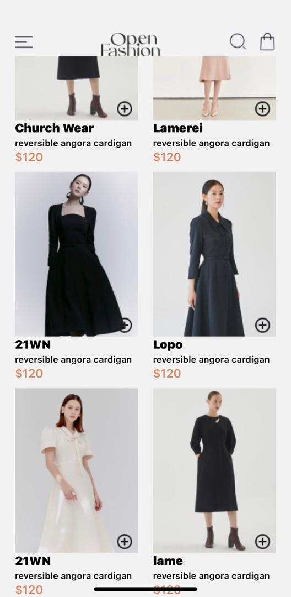
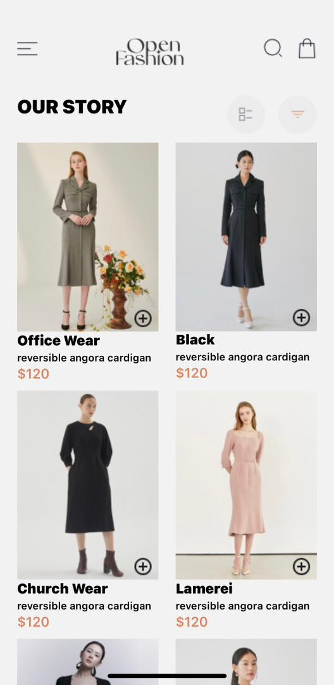
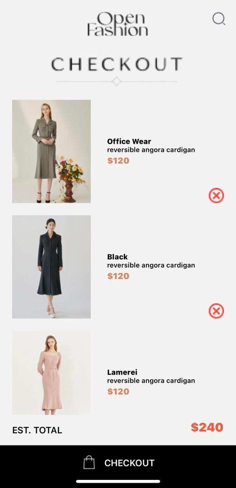

# rn-assignment6-11353419

# Theophilus Sackey
This React Native project is a simple e-commerce app that allows users to view and add products to a shopping cart. The app includes two main components: ourStory.js and checkOut.js. The ourStory.js component displays a list of products, and the checkOut.js component handles the shopping cart functionality.

ourStory.js: Shows products users can buy.

checkOut.js: Manages the shopping cart where users see what they're buying.

# Data Storage
In-Memory: Remembers what's in the cart while using the app.

Saving Purchases: In a real app, it would store purchases even after closing.

